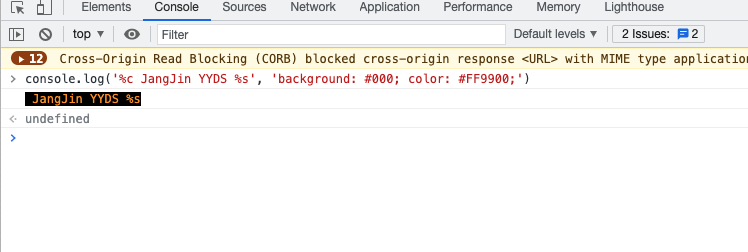
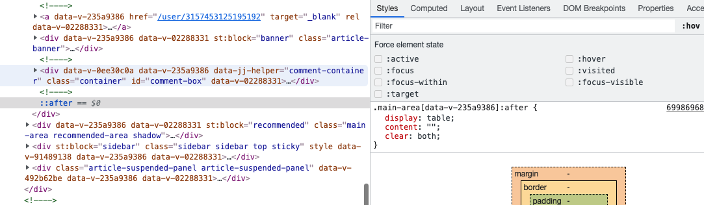
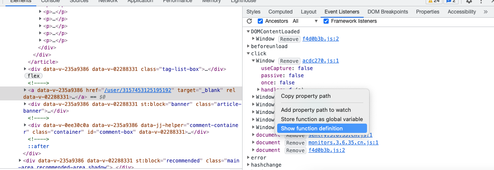
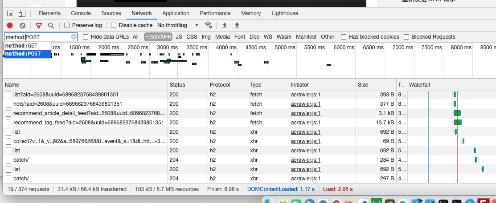
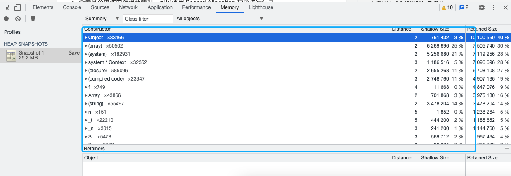
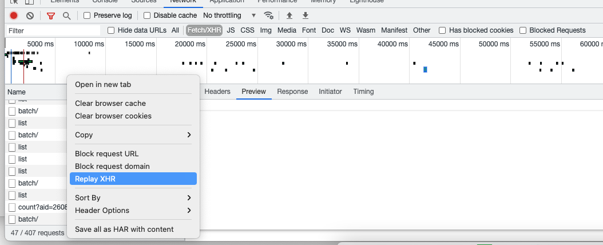

## Chrome 调试的小技巧

### 花式console
* console.log()、console.error()、console.warn()、console.info()打印常规数据信息

* console.table() 表格形式的打印复杂数据结构
* console.group()、console.groupEnd() 分组打印信息
* console.assert() 条件打印 
* console.dir 递归打印对象的所有属性
* console.trace() 追踪函数调用轨迹
* 带样式打印

    

### 伪类元素调试

    

### 查看DOM节点绑定事件
 5

    

### network过滤器
 5

    

* domain:仅显示来自指定域的资源。您可以使用通配符字符（*）纳入多个域
* is：使用 is:running 可以查找 WebSocket 资源，is:from-cache 可查找缓存读出的资源
* Larget-than：显示大于指定大小的资源（以字节为单位）。将值设为1000等同于设置为1k
* scheme：显示通过未保护HTTP（scheme:http）或受保护 HTTPS（scheme:https）检索的资源。
* method：显示通过指定 HTTP 方法类型检索的资源

### 查看内存消耗
* 查看某个操作内存消耗情况，可以使用 HEAP SNAPSHOTS功能进行记录。

    

### 重新发送请求

    

